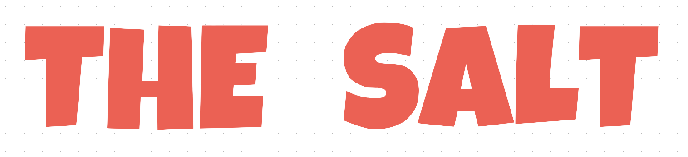

</br>

# 🌟 CNTEX -> 🌟 THE SALT #



### What is this project site? ###
'The Salt' is a shopping mall that sells a selected high quality products.

<br/>

## Services ### 
- site url ==> http://the-salt.co.uk/
- test id >> test@gmail.com
- test password >> test1234 

<br/>

### Tools
<p align='center'>
    
    
    
    
    
    
    
    
</p>

### Architecture ###
- Backend - Djangorestframework RestAPI
- Front - React, Redux-saga 
- UI - Material UI
- Codedeploy - (AWS) EC2, S3

<br/>

### Backend ###
```
$ python -m venv venv

$ source venv/bin/activate

$ pip install -r requirements.txt

$ cd backend

$ python manage.py runserver
```

<br/>

### Frontend ###
#### / Based on ReactJS /
```angular2html
$ cd platform

$ npm start
```

<br/>

### Feature ###
* Fix: 버그 수정 및 오류 개선
* Feat: 기능 추가, 라인 정리
* Refactor: 함수 재정의
* Style: CSS 업데이트
* Init: Initializing
* Build: Build 작업
* Dependency: 의존성 추가 

<br/>

### Report ###


#### ⏱ 21. 9. 3.
```
- Deploy demo version
```
#### ⏱ 21. 9. 7.
```
- DRF permission, token authentication 기능 추가
- Account 관련 action, reducers, saga 업데이트 
- update 1.. Token headers를 활용한 Authentication
- update 2.. DRF의 user model view -> permission allow
```
#### ⏱ 21. 9. 8.
```
- Backend Order 모델 정의 및 업데이트
- Order component 업데이트
```

### Version ###
#### v 1.0
```
    Deploy the-salt.co.uk 
```