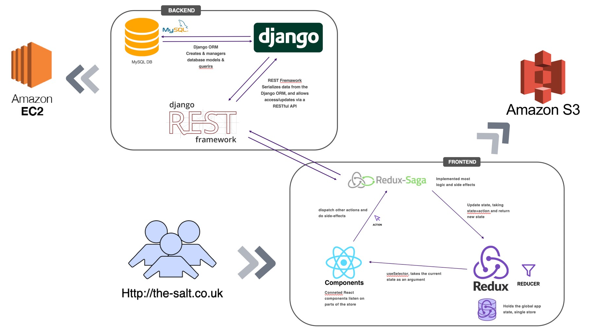
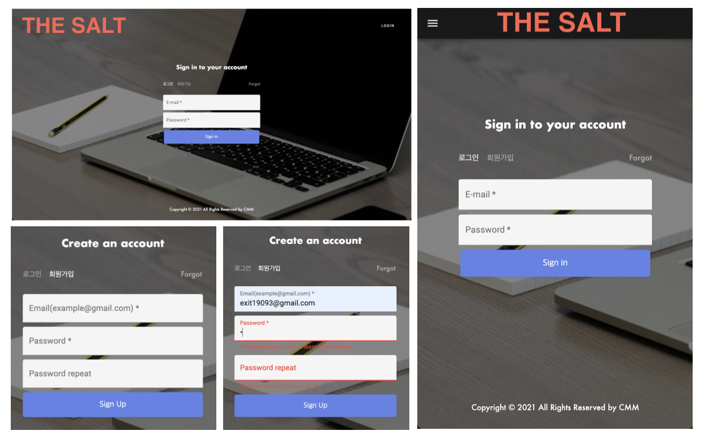
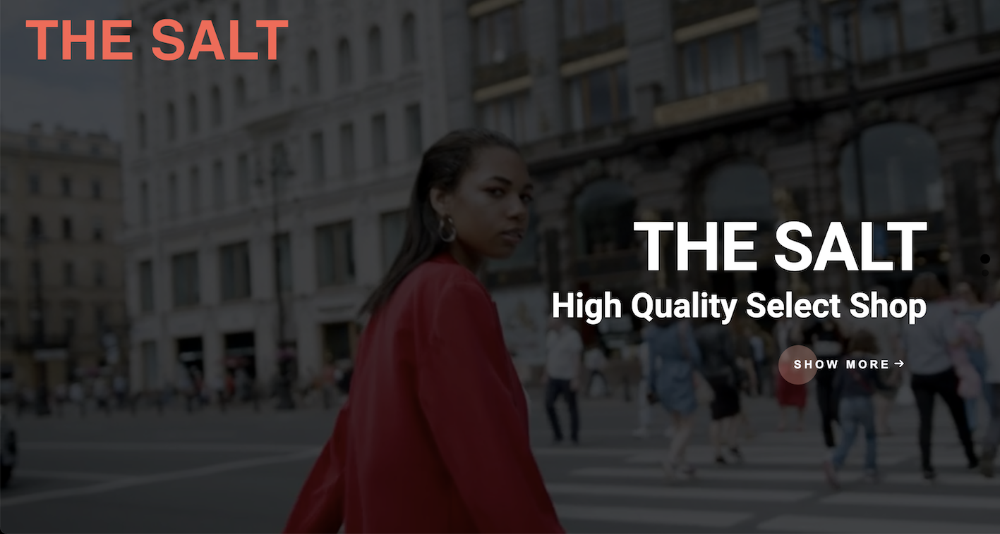
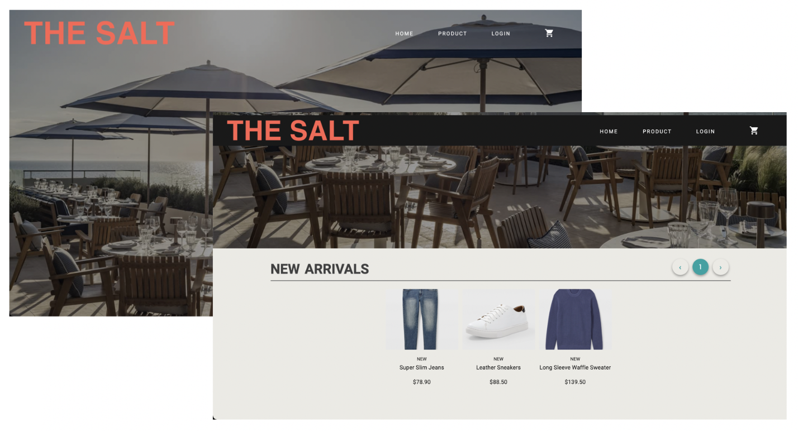
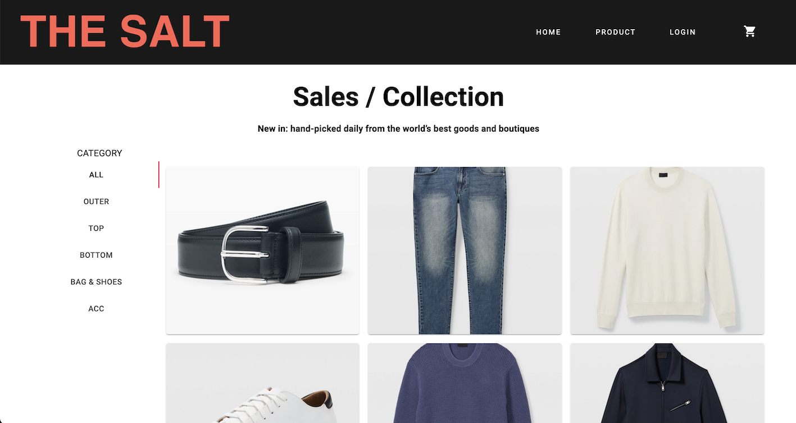
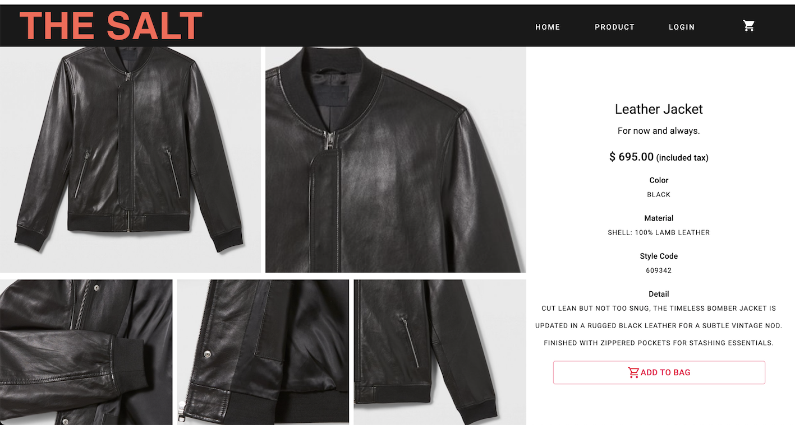
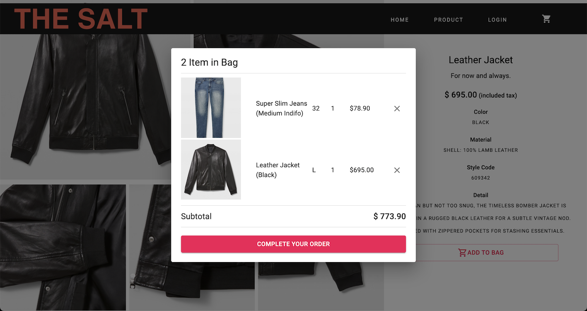
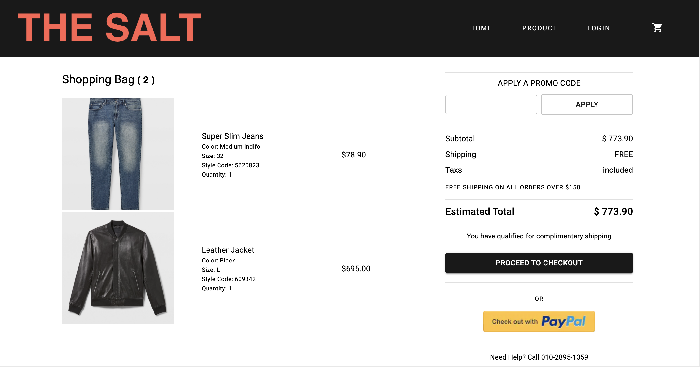
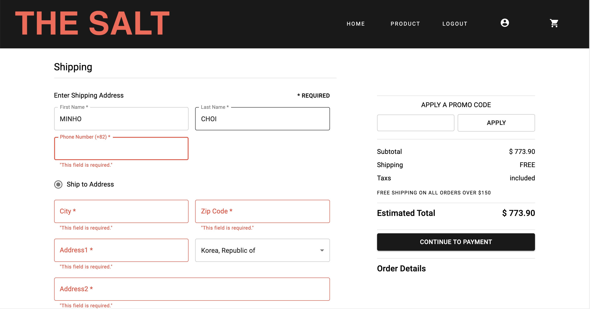
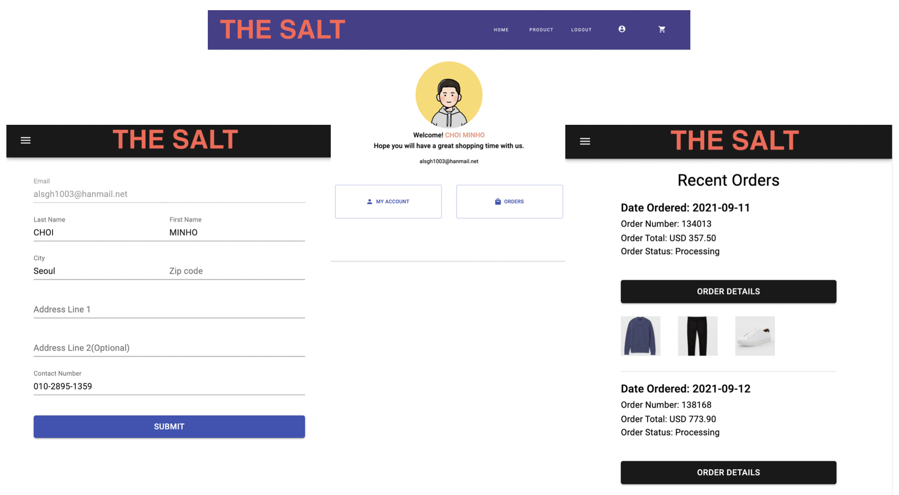

</br>

# 🌟 THE SALT #


### What is this project site? ###
<strong>'The Salt'</strong> is a shopping mall that sells a selected high quality products.


## Services ###
[THE SALT](http://the-salt.co.uk/ "the salt url") or   http://the-salt.co.uk/ 
<p>회원가입 or 테스트 ID를 통해 서비스를 이용할 수 있습니다.</p>
<strong> Test account </strong><br/>
ID ► test@gmail.com<br/>
PW ► test1234


## Tools ##
<p align='center'>
    
    
    
    
    
    
    
    
    
</p>
<br/>

## Architecture ##


<br/>

## 🌟 Main Function

### 👌 SignIn, SignUp

* Django REST API 와 JWT authentication 통신을 합니다.
* 로그인 성공시 Token, user 정보를 받아와 store에 저장합니다.
* store의 Token, user 정보 persist 하게 유지합니다.
* login을 한 이후 navigation의 login 부분은 logout과 profile icon으로 변경됩니다.
* 회원가입의 email, password repeat field는 validation 처리 되어있습니다.

### 👌 MainPage

* the-salt url을 입력후 가장 먼저 보게되는 페이지입니다.
* show more button을 통해 home 페이지로 이동할 수 있습니다.

### 👌 HomePage

* navigation을 통해 플랫폼을 이용할 수 있습니다.
* scrollable navigation으로 스크롤을 내릴시 shrink 됩니다.

### 👌 ProductPage, ProductDetailPage


* product page는 category tab을 통해 원하고자 하는 의류를 분류해 볼 수 있습니다.
* product 상세 페이지에서 제품을 카트에 추가할 수 있습니다.

### 👌 ShoppingCart

* 카트 내의 'x'버튼을 통해 제품을 카트에서 삭제할 수 있습니다.
* 동일한 제품의 추가는 수량으로 업데이트 됩니다.
* 카트내의 버튼을 통해 주문서 작성 페이지로 넘어갈 수 있습니다.

### 👌 Order

* 주문서 작성페이지는 주문할 제품들의 총가격, 배송비(총 가격이 $150 미만일시 적용)를 확인합니다.
* 이 후에 버튼을 통해 주문서 작성을 완료하기 위한 Shipping Page로 넘어갑니다.

### 👌 Shipping

* 주문서 작성 완료 페이지(Shipping)는 로그인이 필요합니다. -> 로그인이 안되어있는 사용자는 로그인 페이지로 이동됩니다.
* 주문서 작성 form의 field들은 모두 작성해야합니다.
* 주문서 제출시 store안의 token을 사용해 REST API 접근권한을 얻어 해당 유저의 주문서를 create 합니다.

### 👌 Profile

* navigation의 얼굴 아이콘을 통해 Profile 페이지로 이동할 수 있습니다.
* profile 페이지는 내정보 수정페이지와 주문확인 페이지로 이동하기 위한 버튼이 있습니다.
* 내 정보 페이지는 로그인한 유저의 정보를 수정할 수 있습니다.
* 주문확인 페이지는 유저의 주문내역을 확인할 수 있습니다. 


<br/>

### Feature ###
* Fix: 버그 수정 및 오류 개선
* Feat: 기능 추가, 라인 정리
* Refactor: 함수, 컴포넌트 재정의
* Style: CSS 업데이트
* Init: Initializing
* Build: Build 작업
* Dependency: 의존성 추가 

<br/>

### Report ###
👌 Backend - BE
👌 Frontend - FE

#### ⏱ 21. 9. 3.
```
Deploy demo version 1.0
```
#### ⏱ 21. 9. 7.
<ul>
    <li>BE. DRF permission, token authentication 기능 추가</li>
    <li>FE. Account component 정의 및 업데이트 (action, reducers, saga)</li>
    <li>update.. DRF의 user model view -> permission allow</li>
    <li>update.. Token headers를 활용한 Authentication</li>
</ul>

#### ⏱ 21. 9. 8.
<ul>
    <li>BE. Create Account view 생성 => http://.../register </li>
    <li>BE. Order 모델 정의 및 업데이트 (id, user, orderProducts)</li>
    <li>FE. Order component 정의 및 업데이트 (페이지 구성 및 cart item 처리)</li>
    <li>FE. Screen, Profile, Account component responsible UI 업데이트</li>
    <li>FE. react-hook-form version 업데이트에 따른 수정사항 적용</li>
    <li>----> input={register(...)} => {...register('...')}</li>
</ul>

#### ⏱ 21. 9. 9.
<ul>
    <li>FE. SignUp 기능 업데이트 (signUp action, reducers(with signIn), signUp saga, signUp api)</li>
    <li>FE. TextField validation 처리 in SignUp component -> react-hook-form</li>
    <li>FE. Home, HomePagination, Products, Footer, Order component responsible UI 업데이트</li>
    <li>FE. HomePagination hover effect 적용</li> 
</ul>

#### ⏱ 21. 9. 10.
<ul>
    <li>BE. Order, OrderProduct 모델 재정의</li>
    <li>FE. Order, Shipping Component 정의 및 기능 업데이트 (pusOrder action, order reducers, orderSaga, order api)</li>
    <li>BE. Order request에 따른 backend create method 정의</li>
    <li>FE. Order request 후 cart initialized action 업데이트 (REMOVE_PRODUCT_FROM_CART)</li>
    <li>FE. Error Handling (Console Err)</li>
    <li> # 1. Strict Mode Issues -> Delete `React.strictMode>` tag in App.js</li>
    <li> # 2. Grid issues justify -> justifyContent </li>
    <li> # 3. Typography descendant issues </li>
</ul>

```
Version 2.0 Update
```
#### ⏱ 21. 9. 11.
<ul>
    <li>FE. Apply webkit line clamp -> Products, Screen </li>
    <li>FE. Appending status in Order request data</li>
    <li>FE. Fixed computedMatch Err -> App.js</li>
    <li>FE. Fixed pagination length</li>
    <li>BE. Apply authentication, permission class to OrderView </li>
</ul>

#### ⏱ 21. 9. 12.
<ul>
    <li>FE. MyOrder component 정의 및 기능 업데이트 (show order, orderProducts list)</li>
</ul>

#### ⏱ 21. 9. 28.
<ul>
    <li>FE. Logo size 수정 </li>
    <li>FE. Footer navigation isLoggedIn state 적용</li>
</ul>